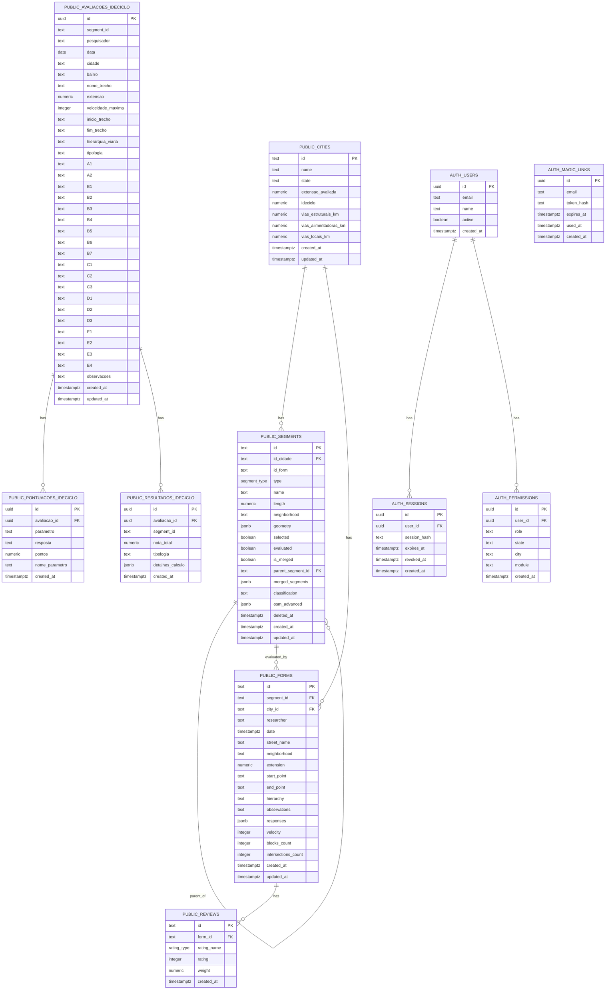

# Diagrama do Banco de Dados

Este diagrama reflete a estrutura atual definida nas migrations do projeto, incluindo os schemas `public` e `auth`.

## Observações

- `AUTH_MAGIC_LINKS.email` referencia o usuário por e-mail no fluxo da aplicação, mas não possui `FOREIGN KEY` formal no banco.
- `PUBLIC_AVALIACOES_IDECICLO.segment_id` e `PUBLIC_RESULTADOS_IDECICLO.segment_id` também não possuem `FOREIGN KEY` formal para `public.segments`.
- Tipos lógicos usados nas migrations:
  - `segment_type`: `Ciclofaixa`, `Ciclovia`, `Ciclorrota`, `Compartilhada`
  - `rating_type`: `A`, `B`, `C`, `D`
- Papéis esperados em `auth.permissions.role`:
  - `admin_global`
  - `admin_estado`
  - `admin_cidade`
  - `avaliador_estrutura_cicloviaria`
  - `refinador_dados_cidade`
  - `visualizador`
- Módulos esperados em `auth.permissions.module`:
  - `admin`
  - `avaliacao_estrutura_cicloviaria`
  - `refinamento_dados_cidade`
